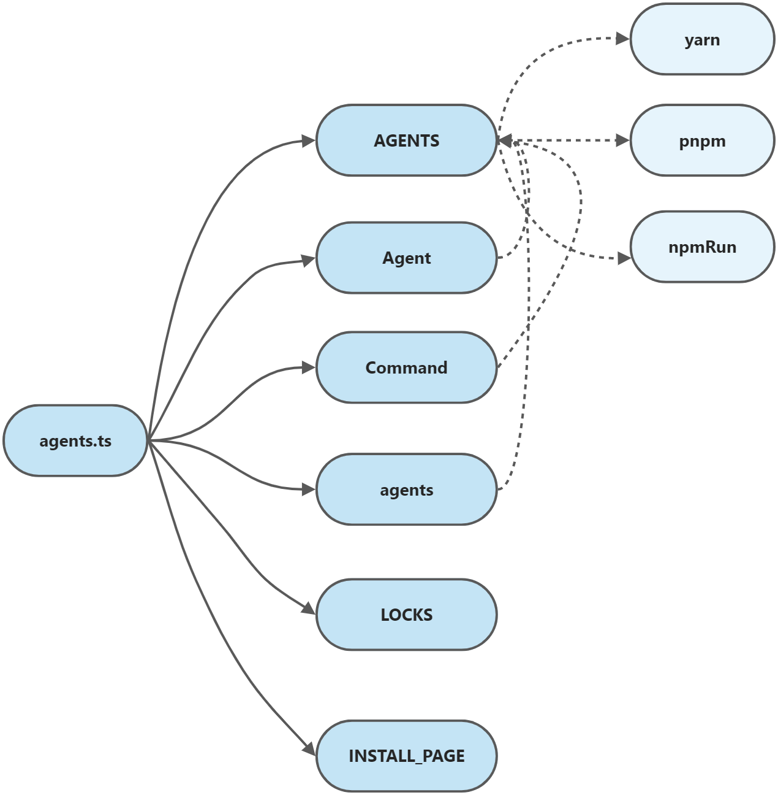

### 第十二期 | ni

#### 一、src/agents.ts




```typescript
const npmRun = (agent: string) => (args: string[]) => {
  //......
}

const yarn = {
    //......
}

const pnpm = {
    //......
}

export const AGENTS = {
    // ......
}

export type Agent = keyof typeof AGENTS
export type Command = keyof typeof AGENTS.npm

export const agents = Object.keys(AGENTS) as Agent[]

export const LOCKS: Record<string, Agent> = {
    //......
} 

export const INSTALL_PAGE: Record<Agent, string> = {
    //......
}
```

##### 1、定义npmRun方法

```typescript
const npmRun = (agent: string) => (args: string[]) => {
    if (args.length > 1)
        return `${agent} run ${args[0]} -- ${args.slice(1).join(' ')}`
    else return `${agent} run ${args[0]}`
}
```

##### 2、定义`yarn`、`pnpm`和`AGENTS`常量

其中，`AGENTS`用于对外暴露。


| **key**  | **npm** |  **yarn** | **yarn@berry**  | **pnpm** | **pnpm@6** |
| ------------- |-------------|------------- |-------------|-------------|-------------|
| **agent** | npm | yarn | yarn | pnpm | pnpm |
| **run** | npmRun | yarn run | yarn run | pnpm run | npmRun |
| **install** | npm i | yarn install | yarn install | pnpm i | pnpm i |
| **frozen** | npm ci | yarn install --frozen-lockfile | yarn install --immutable | pnpm i --frozen-lockfile | pnpm i --frozen-lockfile |
| **global** | npm i -g | yarn global add | npm i -g | pnpm add -g | pnpm add -g |
| **add** | npm i | yarn add | yarn add  | pnpm add | pnpm add |
| **upgrade** | npm update | yarn upgrade | yarn up | pnpm update | pnpm update |
| **upgrade-interactive** | -- | yarn upgrad-interactive | yarn up -i | pnpm update -i | pnpm update -i |
| **execute** | npx | yarn dlx | yarn dlx | pnpm dlx | pnpm dlx |
| **uninstall** | npm uninstall | yarn remove | yarn remove | pnpm remove | pnpm remove |
| **global_uninstall** | npm uninstall -g | yarn global remove | npm uninstall -g | pnpm remove --global | pnpm remove --global |

```typescript
const yarn = {
    'agent': 'yarn {0}',
    'run': 'yarn run {0}',
    'install': 'yarn install {0}',
    'frozen': 'yarn install --frozen-lockfile',
    'global': 'yarn global add {0}',
    'add': 'yarn add {0}',
    'upgrade': 'yarn upgrade {0}',
    'upgrade-interactive': 'yarn upgrad-interactive {0}',
    'execute': 'yarn dlx {0}',
    'uninstall': 'yarn remove {0}',
    'global_uninstall': 'yarn global remove {0}',
}

const pnpm = {
    'agent': 'pnpm {0}',
    'run': 'pnpm run {0}',
    'install': 'pnpm i {0}',
    'frozen': 'pnpm i --frozen-lockfile',
    'global': 'pnpm add -g {0}',
    'add': 'pnpm add {0}',
    'upgrade': 'pnpm update {0}',
    'upgrade-interactive': 'pnpm update -i {0}',
    'execute': 'pnpm dlx {0}',
    'uninstall': 'pnpm remove {0}',
    'global_uninstall': 'pnpm remove --global {0}',
}

export const AGENTS = {
    'npm': {
        'agent': 'npm {0}',
        'run': npmRun('npm'),
        'install': 'npm i {0}',
        'frozen': 'npm ci',
        'global': 'npm i -g {0}',
        'add': 'npm i {0}',
        'upgrade': 'npm update {0}',
        'upgrade-interactive': null,
        'execute': 'npx {0}',
        'uninstall': 'npm uninstall {0}',
        'global_uninstall': 'npm uninstall -g {0}',
    },
    'yarn': yarn,
    'yarn@berry': {
        ...yarn,
        'frozen': 'yarn install --immutable',
        'upgrade': 'yarn up {0}',
        'upgrade-interactive': 'yarn up -i {0}',
        // yarn3 removed 'global'
        'global': 'npm i -g {0}',
        'global_uninstall': 'npm uninstall -g {0}',
    }
    'pnpm': pnpm,
    // pnpm v6.x or below
    'pnpm@6': {
        ...pnpm,
        run: npmRun('pnpm')
    }
}
```

##### 3、定义键类型

```typescript
export type Agent = keyof typeof AGENTS

export type Command = keyof typeof AGENTS.npm

// 等价于
type Agent = "npm" | "yarn" | "yarn@berry" | "pnpm" | "pnpm@6"
```

##### 4、定义`LOCKS`和`INSTALL_PAGE`

```typescript
export const LOCKS: Record<string, Agent> = {
    'pnpm-lock.yaml': 'pnpm',
    'yarn.lock': 'yarn',
    'package-lock.json': 'npm'
}

export const INSTALL_PAGE: Record<Agent, string> = {
    'pnpm': 'https://pnpm.js.org/en/installation',
    'pnpm@6': 'https://pnpm.js.org/en/installation',
    'yarn': 'https://classic.yarnpkg.com/en/docs/install',
    'yarn@berry': 'https://yarnpkg.com/getting-started/install',
    'npm': 'https://www.npmjs.com/get-npm'
}
```

#### 二、src/config.ts

#### 三、收获

#### 四、推荐

[TypeScript - 简单易懂的 keyof typeof 分析](https://juejin.cn/post/7023238396931735583)

